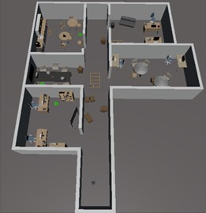
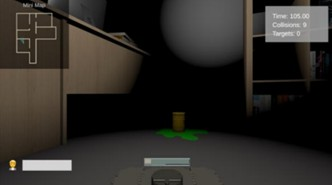
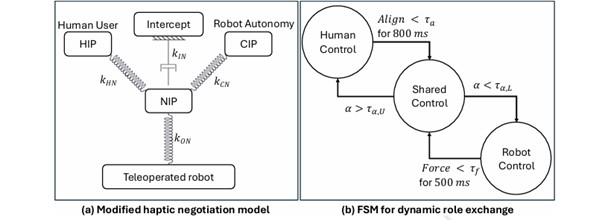
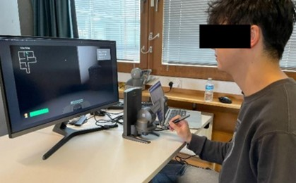

## MSc Dissertation – Human–Robot Teleoperation System with Shared Control and Dynamic Role Exchange

This repository contains a real-time human-robot teleoperation system integrating a Unity based simulation environment with ROS backend services. It demonstrates distributed control, sensor communication, and real-time interaction between Unity and ROS.

---
### Mini-Portfolio

#### Description
This project was developed as part of my MSc Computer Science dissertation at the University of Nottingham. The project aimed to explore how sensory cues could improve shared-control navigation in human-robot teleoperation. This mini-portfolio summarises the dissertation paper in three sections: *Technical Architecture*, *Control Algorithm & System Design*, and *User Study and Data Analysis*.

*Key Technologies: Unity (C#), ROS (Python), rosbridge, RViz, TurtleBot3, rosbag*

#### 1. Technical Architecture
This project involved building a real-time human-robot teleoperation system by integrating a Unity-based simulation environment with ROS backend services. Unity (C#) was used to create a 3D search-and-rescue environment and handle user interaction, while ROS (Python) managed robot control, navigation (via move_base), and sensor data processing.

Communication between the two systems was achieved using rosbridge, enabling data exchange in real time. Robot state, control commands, and sensor data were continuously synchronised between Unity and ROS. RViz was used for visualising robot navigation and debugging, while rosbag was used to record experimental data for later analysis.

The system was designed to operate with low latency, ensuring smooth teleoperation and responsive interaction between the human operator and robot autonomy.


<p align="center">


</p>

<p align="center">
Image 1 (Left): Birdseye view of the Unity3D-based SAR environment with multiple rooms and obstacles used for the study. 
</p>
<p align="center">
Image 2 (Right): First person view of the SAR environment presented to human users during the experiment.
</p>

#### 2. Control Algorithm & System Design
The system implemented a shared control framework combining human input and autonomous navigation through a negotiation model. A haptic device provided user input, while autonomy commands were generated using ROS navigation. These inputs were blended using a spring–damper model to produce a unified control signal.

A finite state machine (FSM) governed dynamic role exchange between human control, shared control, and autonomous control. The transition logic was based on factors such as user-applied force and alignment between human and autonomous inputs.
<p align="center">

</p>

<p align="center">
Image 3: Shared control architecture: (a) haptic negotiation model with HIP, CIP, NIP, and Intercept is used for autonomy negotiation and role allocation. (b) FSM governs role exchanges based on human applied forces and human-autonomy input alignment.
</p>

#### 3. User Study and Data Analysis
A user study was conducted with 15 participants to evaluate the effectiveness of different feedback cues in a simulated search-and-rescue task. Participants completed multiple trials under varying conditions, including haptic, egocentric, and exocentric feedback.

Experimental data was recorded using rosbag and processed to extract performance and behavioural metrics. These included collision counts, trajectory smoothness (jerk and acceleration), control allocation, and alignment between human and autonomous inputs.

Data was resampled and cleaned to remove noise, and statistical analysis was performed using repeated-measures ANOVA and non-parametric tests. The results showed that haptic feedback reduced user effort, while visual cues improved navigation safety and trajectory smoothness, highlighting the importance of multimodal feedback in shared autonomy systems.

<p align="center">

</p>

<p align="center">
Image 4: The experimental setup
</p>


---

## Setup Guide

Follow the steps below to set up the project on your local machine (This guide is written specifically for Windows and Ubuntu 20.04).

### 1. Clone the Repository

```bash
git clone https://github.com/imorange/Mobile-Robot-Project.git
cd Mobile-Robot-Project
```

### 2. Connect the Haptic device to your machine

- [Read documentation and **install their drivers (OpenHaptics for Windows Developer Edition v3.5)**](https://support.3dsystems.com/s/article/OpenHaptics-for-Windows-Developer-Edition-v35?language=en_US)

- Run Touch Smart Setup and initialise Haptic device

### 3. Open the Unity Project

- Open [Unity Hub](https://unity.com/download)

- Click Add → Add Existing Project

- Select the folder Mobile-Robot-Project/MyUnityProject

- Open it with Unity 2021.3+ (or your required version)

### 4. Set Up the ROS Package (Ubuntu 20.04)

#### [Ubuntu Install of ROS Noetic](https://wiki.ros.org/noetic/Installation/Ubuntu) is essential. Follow the steps in the link if not been configured on your own machine.

```bash
# Clone the GitHub repository into your Catkin workspace
cd ~/catkin_ws/src
git clone https://github.com/RcO2Rob/Dis-Project.git

# Restructure the directory
cd ~/catkin_ws/src
mv Dis-Project/myproject .

# Modify move_base launch file
roscd turtlebot3_navigation/launch/
sudo vim move_base.launch

# Edit line 4 to <arg name="cmd_vel_topic" default="/nav_vel" />

# Build catkin workspace
cd ~/catkin_ws
catkin_make
source devel/setup.bash
```

### 5. Set Up ROS# Unity Connection

```bash
# Install rosbridge_server in WSL
sudo apt update
sudo apt install ros-noetic-rosbridge-server

# Find IP address of WSL
hostname -I
```
#### Use that IP address in any RosConnector and modify the port address
<p align="center">

</p>

### 6. Set Up Turtlebot3 Packages

#### [Turtlebot3 Packages](https://emanual.robotis.com/docs/en/platform/turtlebot3/quick-start/) are essential. Follow the steps in the link if not been configured on your own machine.

```bash
# Move map files to Ubuntu root directory. 
cd ~/catkin_ws/src/maps
mv room2.yaml ~/
mv room2.pgm ~/
```
#### Modify room2.pgm path in room2.yaml

<p align="center">

</p>

```bash
# Move all shell scripts to catkin_ws, then launch shell script on a separate terminal
./run_experiment.sh
```

### 7. Run your experiment scene, and everything should be ready to go!

## Brief Scene Description
The location of target objects are placed randomly with one target in each room. In all four conditions (modes), they differ only in the clues presented.
- Condition A has no cues.
- Condition B has Haptic guidance. Haptic guidance is a force feedback proportional to control distribution, enabling the operator to sense autonomy involvement. The feedback reflects HIP–NIP displacement and provides continuity across user, shared, and autonomy control states.
- Condition C has Haptic + Egocentric Cues. Egocentric Cues include (i) anautonomy indicator bar showing the current control allocation parameter 𝛼, and (ii) a direction line clarifying haptic device orientation. These cues clarify autonomy intent and reduce confusion under haptic guidance.
- Condition D Haptic + Egocentric + Exocentric Cues. Exocentric Cues include (i) a top-down mini-map with robot pose and autonomy target, (ii) obstacle detection lines whose opacity scales with distance, and (iii) an anti-collision braking indicator with both visual text and haptic resistance. Together,these cues enhance situational awareness and highlight autonomy’s environmental reasoning.
